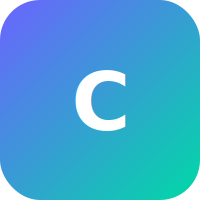

<div align="center">
  
  <h1 align="center">CRAFT</h1>
  <p align="center"><strong>C</strong>omplete <strong>R</strong>esource <strong>A</strong>nd <strong>F</strong>ile <strong>T</strong>oolkit</p>
  <p align="center">All-in-one offline file manager with professional tools — 3D viewer, PDF editor, file converter, QR sharing & more.</p>

  <p align="center">
    <a href="https://github.com/varshinicb1/craft_app/actions"></a>
    <a href="https://github.com/varshinicb1/craft_app/releases"></a>
    <a href="LICENSE"></a>
    <a href="https://flutter.dev"></a>
    <a href="https://dart.dev"></a>
    <a href="https://github.com/varshinicb1/craft_app"></a>
    <a href="https://github.com/varshinicb1/craft_app/issues"></a>
    <a href="https://github.com/varshinicb1/craft_app/pulls"></a>
    
    
  </p>
</div>

---

## Features

| Category | Tools |
|----------|-------|
| 📁 **File Manager** | Browse, search, sort, favorite; batch selection & operations |
| 🖼️ **3D Viewer** | Load and inspect OBJ/STL models with touch gestures |
| 📄 **PDF Editor** | Redact PII (emails, phones, SSN, cards, API keys), batch auto-form fill, side-by-side diff |
| 🔄 **Converter** | Text ⇄ HTML, image format conversion (heic → jpg/png, etc.) |
| ✍️ **Document Generator** | Resumes, invoices, contracts, PRDs — export as PDF |
| 📦 **Archive Extractor** | Extract ZIP archives with file listing |
| 📦 **Archive Creator** | Create ZIP archives from selected files |
| 🖼️ **Image Compressor** | Reduce image file size with quality slider & resize controls |
| 🖼️ **Image Editor** | Crop, rotate, flip, grayscale, sepia, invert & more |
| 🔐 **Encryption Vault** | AES-256-CBC encrypt/decrypt any file with password |
| 📄 **PDF Merger** | Combine multiple PDF files into one document |
| 🔍 **Duplicate Finder** | Find & remove duplicate files by content hash |
| 📝 **Notes** | Create, save & edit text notes with sidebar |
| 📐 **Unit Converter** | Length, weight, temperature, data, speed, area, volume, time |
| 📱 **QR Sharing** | Generate QR codes from files, share via any app |
| ✍️ **Markdown Viewer** | Render `.md` files with formatted markdown (source/rendered toggle) |
| 🎨 **Theme Support** | Light, dark, and system-follow themes |
| 📊 **Dashboard** | Quick stats, recent files, category counts at a glance |
| 🏞️ **Media Playback** | Video player, audio player with playback controls |
| 🔍 **Full-Text Search** | Search across file names and metadata |

## Screenshots

<p align="center">
  
  
  
  
</p>

<details>
<summary><b>📸 Submit your screenshots</b></summary>
<br>
We'd love to feature real screenshots from users! Open a PR replacing the placeholders above with actual screenshots from the app.
</details>

## Getting Started

### Prerequisites

- Flutter SDK >= 3.10.0
- Dart SDK >= 3.0.0
- Android Studio / Xcode / VS Code

### Installation

```bash
# Clone the repo
git clone https://github.com/varshinicb1/craft_app.git
cd craft_app

# Install dependencies
flutter pub get

# Run on your device
flutter run
```

### Build for release

```bash
# Android APK
flutter build apk --release

# Android App Bundle
flutter build appbundle --release

# iOS (macOS only)
flutter build ios --release

# Web
flutter build web --release
```

## Tech Stack

| Layer | Technology |
|-------|-----------|
| Framework | Flutter 3.10+ |
| Language | Dart 3.0+ |
| State Management | Provider |
| Local DB | SQLite (sqflite) |
| Local Storage | SharedPreferences |
| File Handling | file_picker, path_provider |
| PDF | dart_pdf |
| Markdown | flutter_markdown |
| 3D Rendering | Custom OBJ/STL parser + vector_math |
| Media | video_player, just_audio |
| Archiving | archive (Dart) |
| Image Processing | image (Dart) — encode, decode, resize, compress |
| Sharing | share_plus, qr_flutter |

## Project Structure

```
lib/
├── app.dart                  # App shell with bottom navigation
├── main.dart                 # Entry point
├── database/                 # SQLite database layer
│   └── app_database.dart
├── models/                   # Data models
│   └── file_item.dart
├── providers/                # State (Provider)
│   └── app_provider.dart
├── screens/                  # UI screens
│   ├── home_screen.dart
│   ├── viewer_screen.dart
│   ├── converter_screen.dart
│   ├── editor_screen.dart
│   ├── share_screen.dart
│   └── settings_screen.dart
├── services/                 # Business logic services
│   ├── isolate_service.dart
│   └── pdf_editor_service.dart
├── theme/                    # Theming
│   └── app_theme.dart
├── tools/                    # Standalone tools
│   ├── archive_extractor.dart
│   ├── archive_creator.dart
│   ├── contract_generator.dart
│   ├── duplicate_finder.dart
│   ├── encryption_vault.dart
│   ├── image_compressor.dart
│   ├── image_editor.dart
│   ├── invoice_generator.dart
│   ├── notes_app.dart
│   ├── pdf_merger.dart
│   ├── prd_generator.dart
│   ├── resume_generator.dart
│   └── unit_converter.dart
└── widgets/                  # Reusable widgets
    ├── audio_player_widget.dart
    ├── bottom_nav.dart
    ├── file_list_tile.dart
    └── model_viewer_3d.dart
```

## Contributing

Contributions are what make the open-source community such an amazing place! Any contributions you make are **greatly appreciated**.

1. Fork the project
2. Create your feature branch (`git checkout -b feature/amazing-feature`)
3. Commit your changes (`git commit -m 'Add amazing feature'`)
4. Push to the branch (`git push origin feature/amazing-feature`)
5. Open a Pull Request

### Development guidelines

- Run `flutter analyze` before committing — zero warnings expected
- Run `flutter test` to ensure all 104+ tests pass
- Follow the existing code style (no trailing comments, Provider pattern)

## License

Distributed under the MIT License. See `LICENSE` for more information.

---

<p align="center">
  <a href="https://github.com/varshinicb1/craft_app/issues">Report Bug</a>
  ·
  <a href="https://github.com/varshinicb1/craft_app/issues">Request Feature</a>
  ·
  <a href="https://github.com/varshinicb1/craft_app">Star the Repo</a>
</p>

<p align="center">
  Made with ❤️ by <a href="https://github.com/varshinicb1">varshinicb1</a>
</p>
